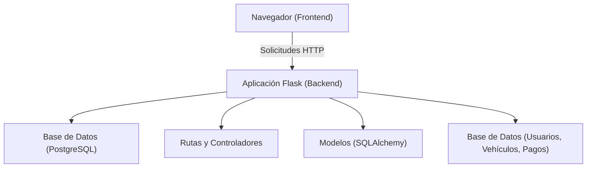
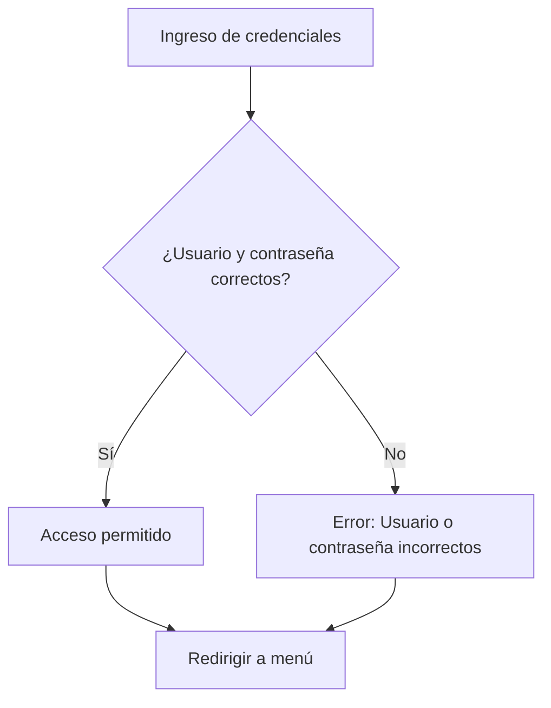
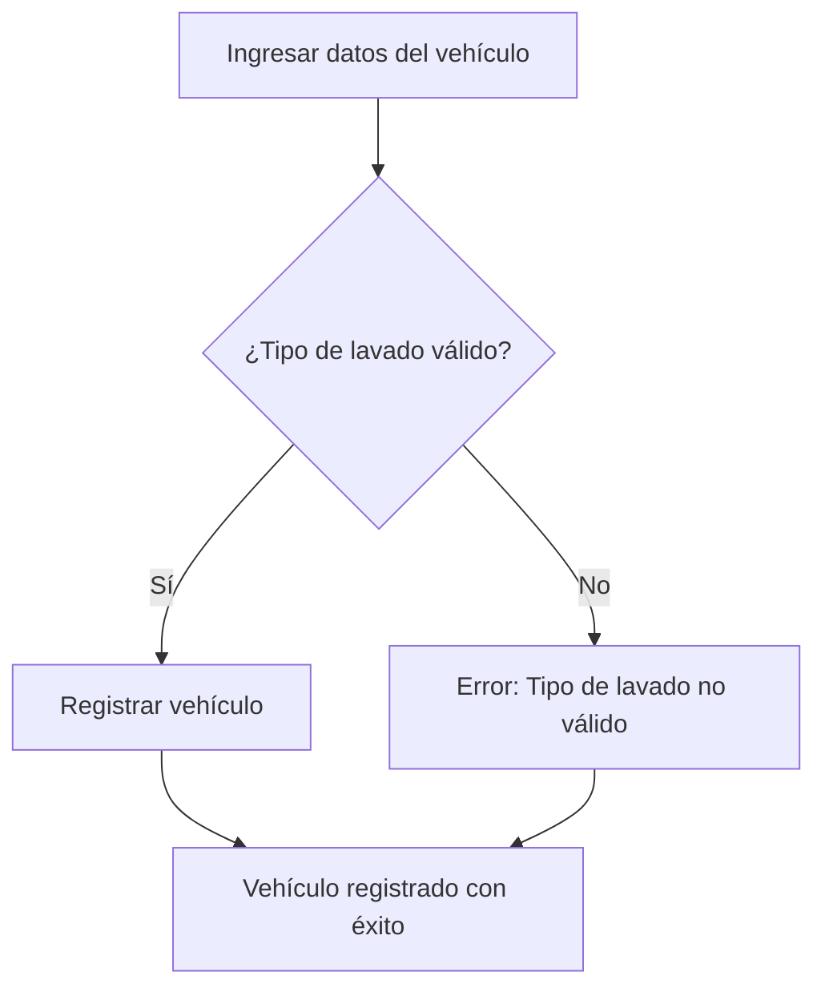
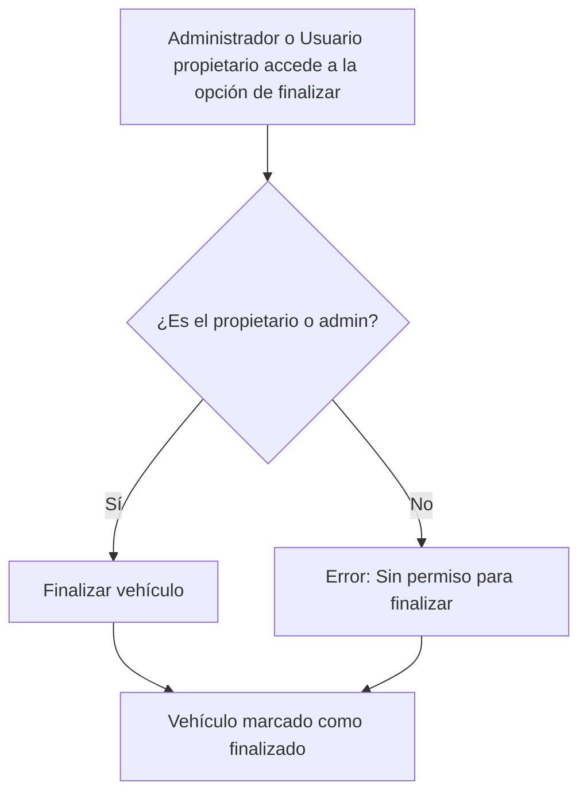
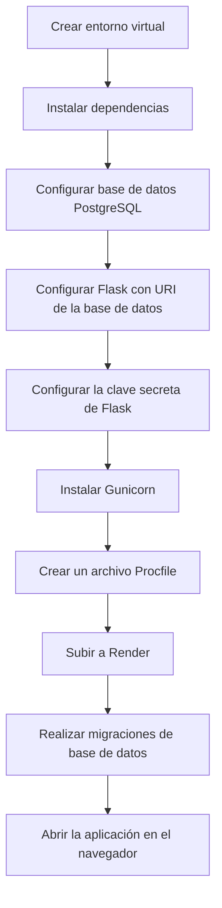
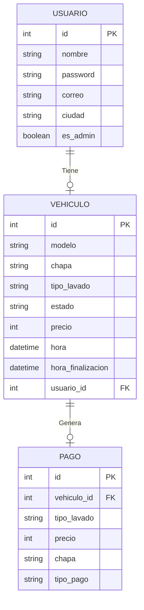
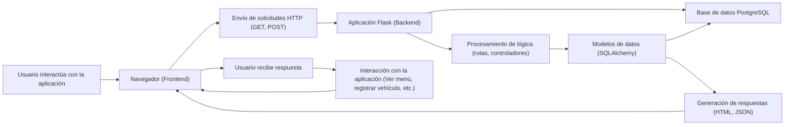

                                       Introducción

Este proyecto es una aplicación web construida con **Flask** para gestionar el lavado de vehículos, incluyendo el registro de usuarios, vehículos, pagos y la gestión de estados de lavado. La aplicación utiliza **PostgreSQL** como sistema de base de datos y **SQLAlchemy** como ORM (Object Relational Mapper) para interactuar con la base de datos.

Requisitos

Para ejecutar este proyecto, necesitas tener los siguientes requisitos previos:

- **Python 3.x** o superior
- **PostgreSQL** (para la base de datos)
- **pip** (para la instalación de paquetes)
- **Virtualenv** (opcional, pero recomendado para gestionar las dependencias)


Configuración del Entorno de Desarrollo

Crear un Entorno Virtual

Para evitar conflictos con otras aplicaciones Python en tu sistema, es recomendable crear un entorno virtual.

Crea un entorno virtual con el siguiente comando:

                     ```bash
                  python3 -m venv venv

Instala las dependencias con el siguiente comando:

               pip install -r requirements.txt

Ejecutar la Aplicación

Para ejecutar la aplicación de forma local en tu máquina, sigue estos pasos:

Configura la clave secreta de Flask (para gestionar las sesiones y la seguridad). Asegúrate de cambiarla por una clave más segura en producción:

                      python
               app.secret_key = "supersecretkey"


Ejecuta el servidor de Flask con el siguiente comando:


                         python my_program.py
Abre tu navegador y visita http://localhost:5000 para interactuar con la aplicación.

                   Estructura de Archivos

                  /project_root
                  /my_program.py               # Archivo principal con la lógica de la aplicación
                  /templates/           # Archivos HTML de la interfaz de usuario
                  /static/              # Archivos estáticos (CSS, JS, imágenes)
                  /requirements.txt     # Lista de dependencias
                  /Procfile             # Configuración de despliegue en Render


                                   
                                   Conclusión
Este proyecto proporciona un sistema de gestión de lavados de vehículos fácil de usar, con características de autenticación, gestión de vehículos y pagos, y una interfaz de usuario basada en Flask y PostgreSQL. Está diseñado para ser flexible y puede adaptarse a varios entornos de despliegue, como servidores locales o plataformas en la nube como Render


%% Diagrama: Arquitectura del Sistema




%% Diagrama: Flujo de Inicio de Sesión




%% Diagrama: Registro de Vehículo





%% Diagrama: Finalización de Vehículo




%% Diagrama: Configuración del Entorno




%% Diagrama: Modelo de Datos




%% Diagrama: Interacción Completa del Sistema



